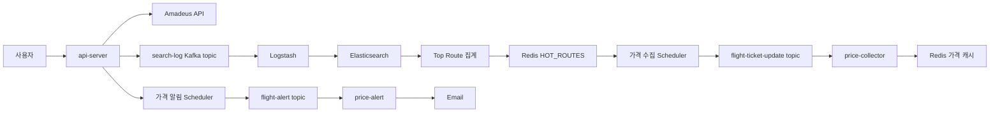

# SkyTracker

Real-time Flight Price Tracking & Popular Route Analytics

SkyTracker는 사용자가 항공권을 반복해서 검색하지 않아도 가격 변동을 추적하고, 인기 노선과 최저가 정보를 빠르게 확인할 수 있도록 만든 항공권 가격 추적 서비스입니다.

단순 항공권 검색 API에 머무르지 않고, 사용자의 검색 로그를 분석해 수요가 높은 노선을 선별하고 해당 노선을 중심으로 가격 데이터를 주기적으로 수집합니다. 수집된 데이터는 Kafka, Redis, Elasticsearch를 통해 검색 응답, 인기 노선 분석, 가격 하락 알림으로 이어집니다.

## 프로젝트 소개

항공권 가격은 변동성이 크고 사용자가 직접 같은 조건을 반복 검색해야 한다는 불편함이 있습니다. SkyTracker는 이 문제를 다음 흐름으로 해결합니다.

| 목표 | 구현 방식 |
| --- | --- |
| 반복 검색 감소 | 사용자가 등록한 항공권 조건을 스케줄러가 주기적으로 재조회 |
| 빠른 검색 응답 | 인기 노선 검색 결과를 Redis에 캐싱 |
| 가격 하락 알림 | 이전 최저가와 신규 가격을 비교해 Kafka 이벤트 발행 후 메일 전송 |
| 인기 노선 제공 | 검색 로그를 Elasticsearch에 저장하고 Top Route를 집계 |

## 핵심 기능

| 기능 | 설명 |
| --- | --- |
| 항공권 검색 | Amadeus Flight Offers API를 호출해 항공권 검색 결과 제공 |
| 검색 결과 캐싱 | Redis에 저장된 인기 노선 결과가 있으면 외부 API 호출 없이 캐시 응답 반환 |
| 가격 알림 등록 | 사용자가 출발지, 도착지, 날짜, 인원, 여행 등급 조건으로 가격 알림 등록 |
| 가격 하락 감지 | 3시간마다 등록된 알림 조건을 재조회하고 이전 가격보다 낮으면 알림 이벤트 발행 |
| 메일 알림 발송 | `flight-alert` Kafka 토픽을 소비해 사용자에게 이메일 발송 |
| 인기 노선 분석 | 검색 로그를 Elasticsearch aggregation으로 집계해 Hot Route Top 10 제공 |
| OAuth2/JWT 인증 | Google, Kakao, Naver OAuth2 로그인 및 JWT 기반 인증 처리 |
| OpenAI 챗 기능 | 사용자 요청 기반 여행/항공권 관련 대화 기능 제공 |

## 아키텍처

SkyTracker는 Gradle multi-module 기반의 Spring Boot 프로젝트이며, API 서버와 Kafka consumer 서비스를 분리했습니다.


### 서비스 구성

```text
skytracker/
├── apps/
│   ├── api-server        # REST API, OAuth2/JWT, 검색, 알림 등록, 스케줄러
│   ├── price-alert       # flight-alert Kafka consumer, 메일 발송
│   └── price-collector   # flight-ticket-update Kafka consumer, Redis 저장
├── libs/
│   ├── common            # 공통 DTO, enum, exception
│   └── core              # RedisClient, AmadeusFlightSearchService, cache/parser
├── adapters/
│   └── kafka             # Kafka producer 설정 및 메시지 발행 서비스
└── k8s/                  # Kubernetes manifest
```

### 데이터 흐름



## ERD


주요 도메인은 사용자, 항공권 알림 조건, 사용자별 알림 구독 관계로 나뉩니다.

| 엔티티 | 역할 |
| --- | --- |
| `User` | OAuth2 기반 사용자 정보와 권한 관리 |
| `FlightAlert` | 항공권 알림 조건의 공통 원본 데이터 |
| `UserFlightAlert` | 사용자와 알림 조건의 연결 및 활성화 상태 관리 |
| `ChatRoom` | OpenAI 챗 기능의 대화방 |
| `ChatMessage` | 사용자/assistant 메시지 저장 |

## 기술 스택 및 선택 이유

| 영역 | 기술 | 선택 이유 |
| --- | --- | --- |
| Language | Java 17 | Spring Boot 3.x와 호환성이 높고, 안정적인 서버 애플리케이션 개발에 적합 |
| Backend | Spring Boot, Spring Security, Spring Data JPA | REST API, 인증/인가, 트랜잭션 기반 도메인 로직을 일관되게 구현 |
| Query | QueryDSL | 사용자별 알림 조회와 fetch join 기반 조회 최적화를 타입 안정성 있게 처리 |
| Messaging | Kafka | 가격 수집, 검색 로그, 알림 발송을 비동기로 분리해 서비스 간 결합도 감소 |
| Cache | Redis Sentinel | 인기 노선/가격 데이터 캐싱과 장애 대응 가능한 캐시 레이어 구성 |
| Search/Analytics | Elasticsearch, Logstash, Kibana | 검색 로그 수집, 인기 노선 집계, 로그/트래픽 시각화에 활용 |
| Database | MySQL | 사용자, 알림, 채팅 등 정합성이 중요한 도메인 데이터 저장 |
| Infra | Docker, Kubernetes | 서비스별 컨테이너화와 namespace 기반 배포 구조 구성 |
| CI | GitHub Actions | 모듈별 변경 사항에 따라 bootJar, Docker image build, Docker Hub push 자동화 |

## 주요 문제와 해결 과정

### 1. 공통 알림 조건 삭제로 인한 다른 사용자 알림 영향

| 구분 | 내용 |
| --- | --- |
| 문제 | 사용자가 알림을 삭제할 때 공통 `FlightAlert` 원본을 삭제하면 같은 조건을 구독한 다른 사용자 알림까지 영향받을 수 있음 |
| 원인 | `FlightAlert`와 `UserFlightAlert`의 책임이 분리되어야 하는데 삭제 대상이 공통 알림 조건에 가까웠음 |
| 해결 | 삭제 대상을 `FlightAlert`가 아닌 사용자별 구독 관계인 `UserFlightAlert`로 변경 |
| 검증 | `PriceAlertServiceTest`에서 구독 관계만 삭제되고 `FlightAlertRepository.delete()`가 호출되지 않음을 검증 |

### 2. Kafka consumer 처리 안정성 개선

| 구분 | 내용 |
| --- | --- |
| 문제 | 외부 API, Redis, 메일 발송 등 I/O 작업이 포함된 consumer에서 처리 지연 시 불필요한 리밸런싱 가능성 존재 |
| 원인 | consumer heartbeat/session timeout이 짧으면 일시적인 지연에도 consumer group이 흔들릴 수 있음 |
| 해결 | `CooperativeStickyAssignor`, manual ack, batch listener, session timeout 조정 적용 |
| 결과 | 메시지 처리 완료 후 offset을 커밋하고, consumer group 리밸런싱 부담을 줄이는 방향으로 설정 개선 |

### 3. Redis TTL과 가격 캐시 보존 시간 조정

| 구분 | 내용 |
| --- | --- |
| 문제 | 가격 수집 스케줄과 Redis TTL이 맞지 않으면 다음 수집 전 캐시가 만료되어 cache hit가 떨어질 수 있음 |
| 원인 | 가격 수집 주기와 TTL 간 여유 시간이 부족했음 |
| 해결 | Kafka consumer가 Redis list에 저장할 때 최근 20개만 유지하고 TTL을 13분으로 조정 |
| 결과 | 저장 데이터 크기를 제한하면서도 수집 주기 사이 캐시가 유지되도록 개선 |

### 4. Kubernetes 배포 중 인프라 의존성 문제 정리

| 구분 | 내용 |
| --- | --- |
| 문제 | MySQL, Redis, Elasticsearch, Kafka 등 의존 서비스가 많아 배포 순서와 secret 동기화 문제가 발생 |
| 원인 | namespace가 분리되어 있고, ECK는 Elasticsearch 비밀번호를 배포 시점에 자동 생성 |
| 해결 | `k8s/DEPLOY.md`에 namespace, Helm repo, ECK, Strimzi, app 배포 순서와 트러블슈팅 표 작성 |
| 결과 | `app-secret` namespace 복사, ECK 비밀번호 동기화, Strimzi 0.44.0 고정 등 재현 가능한 배포 절차 확보 |

## 성능 개선 전후 수치

Redis cache-aside 전략을 적용해 인기 노선 검색 결과가 캐시에 존재하는 경우 외부 API 호출 없이 응답하도록 개선했습니다.

| 항목 | 개선 전 | 개선 후 |
| --- | ---: | ---: |
| 항공권 검색 응답 시간 | 약 4초 | 약 0.3초 |
| 처리 방식 | Amadeus API 직접 호출 | Redis 캐시 조회 |
| 외부 API 의존도 | 매 요청마다 발생 | cache hit 시 미발생 |

측정 조건은 동일 검색 조건에서 외부 API 직접 조회와 Redis 캐시 조회를 비교한 값입니다. 네트워크 상태와 Amadeus API 응답 시간에 따라 절대값은 달라질 수 있어, README에는 병목 개선 방향과 대표 측정값으로 기록했습니다.

## 테스트 전략

현재 테스트는 알림 도메인의 핵심 비즈니스 규칙을 단위 테스트로 검증하는 데 초점을 맞췄습니다.

| 테스트 대상 | 검증 내용 |
| --- | --- |
| `deleteUserFlightAlertDeletesOnlyUserSubscription` | 알림 삭제 시 사용자 구독 관계만 삭제하고 공통 알림 조건은 삭제하지 않음 |
| `deleteUserFlightAlertThrowsWhenSubscriptionDoesNotBelongToUser` | 다른 사용자의 알림 삭제 요청을 예외로 처리 |
| `toggleAlertChangesActiveState` | 알림 활성화 상태 토글 검증 |
| `getUserFlightAlertsMapsSubscriptionsWithFlightAlert` | 사용자 알림 목록 조회 DTO 매핑 검증 |

향후 보강할 테스트는 다음과 같습니다.

- Redis cache hit/miss에 따른 항공권 검색 응답 분기 테스트
- Kafka producer/consumer serialization 테스트
- Elasticsearch aggregation 결과 파싱 테스트
- Spring Security 인증/인가 통합 테스트

## 배포 구조

### CI

GitHub Actions는 모듈별 변경 경로에 따라 bootJar를 생성하고 Docker 이미지를 빌드한 뒤 Docker Hub에 push합니다.

| Workflow | 대상 |
| --- | --- |
| `api-server-deploy.yml` | `apps/api-server`, `libs/common`, `libs/core`, `adapters/kafka` 변경 시 API 서버 이미지 빌드/푸시 |
| `price-alert-deploy.yaml` | `apps/price-alert` 변경 시 알림 서비스 이미지 빌드/푸시 |
| `price-collector-deploy.yaml` | `apps/price-collector` 변경 시 가격 수집 서비스 이미지 빌드/푸시 |

### Kubernetes

Kubernetes manifest는 역할별 namespace를 분리합니다.

| Namespace | 구성 |
| --- | --- |
| `apps` | api-server, price-alert, price-collector, service, HPA |
| `data` | MySQL, Redis Sentinel, Elasticsearch, Kibana, Logstash |
| `kafka` | Strimzi Kafka cluster, Kafka topics |

배포는 `k8s/DEPLOY.md`의 순서에 따라 MySQL, Redis, Elasticsearch, Kafka를 먼저 구성한 뒤 애플리케이션을 배포합니다. `api-server`는 HPA를 통해 CPU 사용률 기준으로 1~5개 pod까지 확장되도록 구성했습니다.

## 회고

### 잘한 점

- 항공권 검색, 인기 노선 분석, 가격 알림을 Kafka 기반 비동기 파이프라인으로 연결해 단순 CRUD를 넘어선 데이터 흐름을 구현했습니다.
- Redis, Elasticsearch, MySQL의 역할을 분리해 캐시, 분석, 영속 데이터를 각각의 목적에 맞게 저장했습니다.
- 알림 삭제처럼 도메인 모델의 책임이 섞인 문제를 테스트와 함께 수정하며 데이터 영향 범위를 줄였습니다.

### 아쉬운 점

- Kafka, Redis, Elasticsearch를 포함한 통합 테스트가 부족해 운영 환경과 유사한 검증은 아직 제한적입니다.
- 현재 GitHub Actions는 Docker image build/push까지 자동화되어 있으며, Kubernetes rollout 자동화는 추가 보강이 필요합니다.
- Kubernetes manifest에 readiness/liveness probe와 Ingress 구성이 명시되어 있지 않아 운영 안정성 관점의 보완 여지가 있습니다.

### 다음 개선 계획

- Testcontainers 기반 Kafka/Redis 통합 테스트 추가
- Kubernetes readiness/liveness probe 및 rollout 전략 보강
- GitHub Actions에서 Kubernetes 배포와 rollout status 확인까지 자동화
- 가격 수집/알림 지표를 Prometheus/Grafana로 관측 가능하게 개선
